## 1: 3D Printing (Task 1)

In this task, I understood the *working of a 3D printer* - its hardware aspects, printer and PLA settings etc. I also learnt about **STL (Stereo Lithography)** files and designed a **keychain model** using **Autodesk**. Finally, the file was sliced and printed.

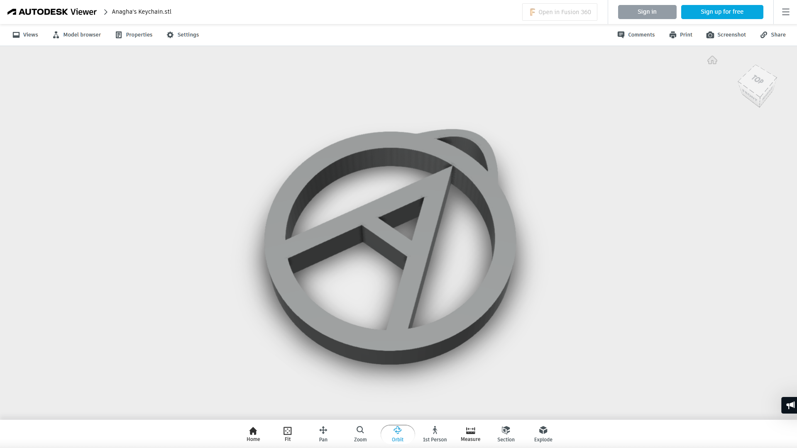

## 2: API (Task 2)

This task involved understanding what an **API** is, along with its applications. To understand how it works, I built **SkySwings**, a web-based weather app that provides **real-time weather updates** for the cities being searched, using the **OpenWeatherAPI**.

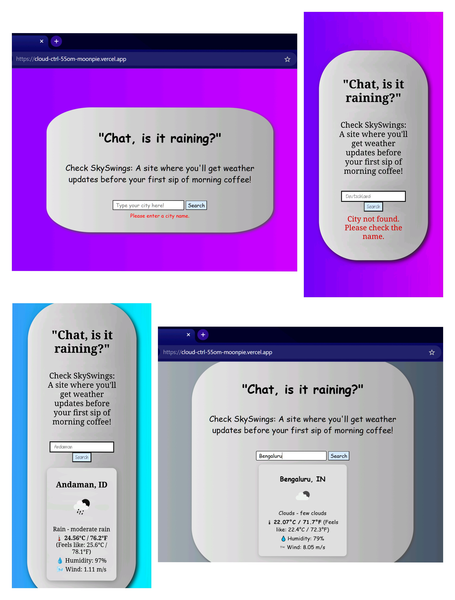
[View the Website](https://cloud-ctrl-55om-moonpie.vercel.app/)

## 3: Working with GitHub (Task 3)

Here, I familiarised myself with the **GitHub workflow** by *forking, committing and creating a pull request*. The task was to *fix an addition error* in a Python code which was causing it to fail test cases. This was executed by **cloning** the given repository, **editing** the segment causing the error and finally, **submitting** the changes via the pull request.

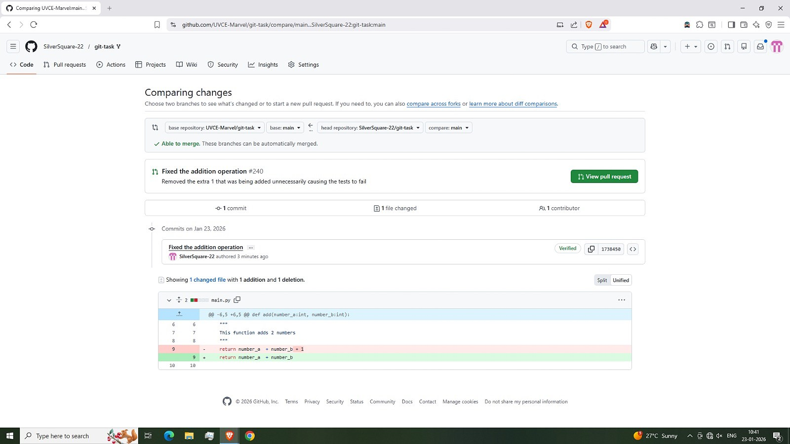

## 4: Command Lines on Ubuntu (Task 4)

The task was to get familiarised with the **Ubuntu command line interface** and **execute subtasks** using command prompts. The following commands were used:

* `cd`: Stands for *change directory*; it is used to navigate and switch between working locations.

* `mkdir`: Short for *make directory*; it is used whenever a new folder is to be created.

* `touch`: It creates a *blank file* of the specified format without opening any editor.

* `ls`: Short for *list*; it lists down the files and folders present in the *current directory*.

* `mkdir folder{start..end}`: Used to make multiple directories using one single command. Here, 'start' and 'end' are integer values which form the range boundaries.

* `echo`: This command writes contents into a file.

* `cat`: Concatenates the contents of multiple files and displays the final joined value

## 5: Linear Regression from Scratch (Task 5)

In this task, **Linear Regression** was implemented manually using **Gradient Descent** and compared with **Scikit-Learn’s LinearRegression** using the **California Housing dataset**. Features were standardised before training to ensure **stable convergence**.

The scratch model *computed predictions, gradients and updated weights* iteratively. Its performance was evaluated using **MSE**, **MAE** and **R² score**, and compared with the **sklearn model**.

#### Results:
Scratch Model -> R² ≈ 0.576
Sklearn Model -> R² ≈ 0.576

Both models produced **nearly identical results**, confirming the correctness of the manual implementation. The R² score indicates that the model explains about **57%** of the variance in housing prices. An **Actual vs Predicted plot** further showed a **positive linear trend** with **moderate scatter**, reflecting real-world data complexity.

This task helped in understanding **gradient descent**, **feature scaling** and the advantages of **built-in ML libraries**.

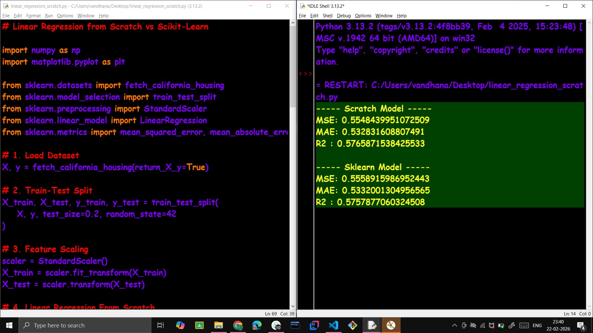
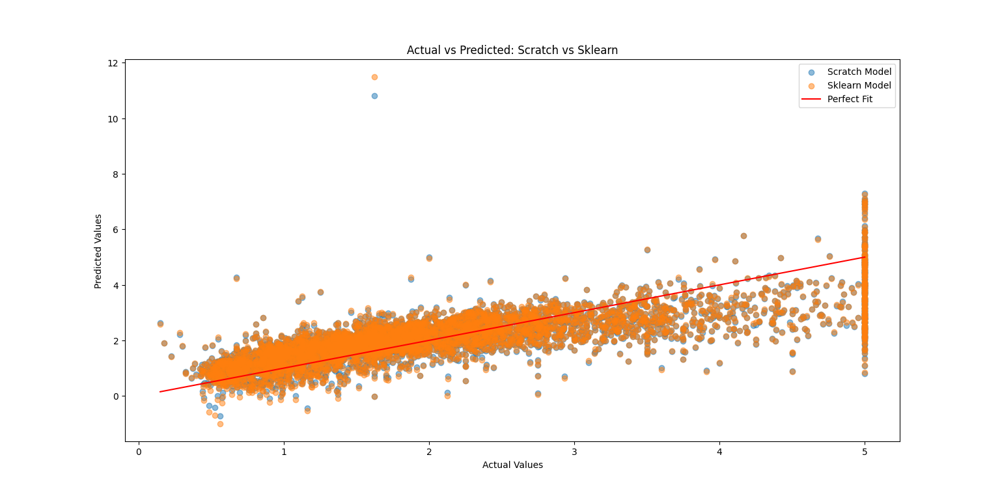

## 6: The Matrix Puzzle (Task 6)

This task introduced me to practical **NumPy** operations such as *reshaping, transposing and visualising matrices* using **Matplotlib**. I explored how multidimensional arrays can be manipulated to reveal hidden patterns and images. I also understood how data orientation and structure affect visualisation, and strengthened my debugging and problem-solving skills using NumPy.

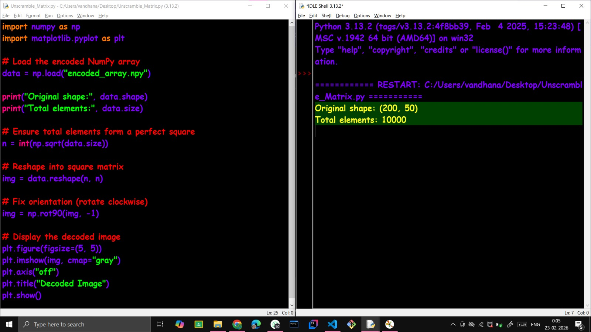

## 7: Portfolio Webpage (Task 7)

In this task, I built a personal portfolio website using **HTML**, **CSS** and **JavaScript**. The webpage includes sections such as **About Me**, **Skills**, **Projects**, **Social Links** etc. The site is designed to be responsive across devices and has been deployed using **GitHub Pages**. This task helped me improve my **frontend fundamentals** and understand **basic deployment workflows** using GitHub.

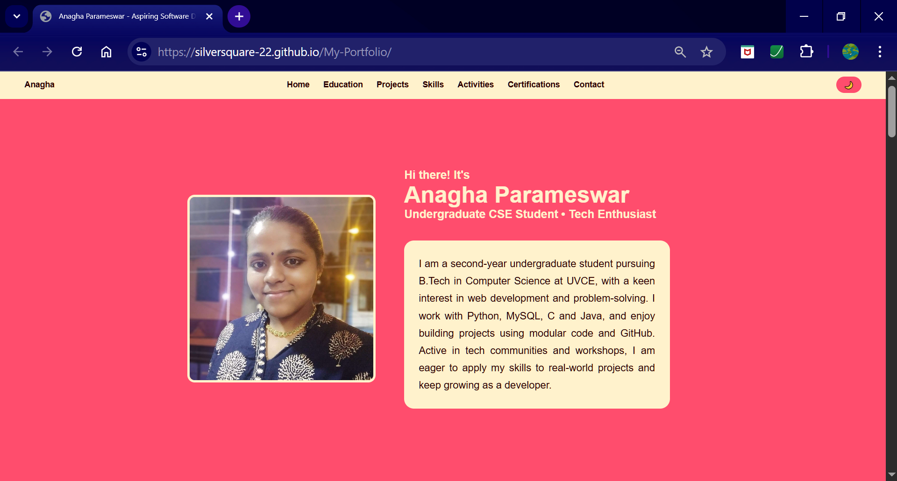
[View the Website](https://silversquare-22.github.io/My-Portfolio/)

## 8: Resource Article using Markdown (Task 8)

For this task, I wrote a beginner-friendly technical article titled **“Why Python is a Different Breed”** using Markdown. The article focuses on Python’s **simplicity**, **readable syntax** and why it is often recommended as a **first programming language**. It also briefly highlights Python’s **rich ecosystem of libraries**, while also emphasising the relevance of Markdown in formatting text.

[View the Resource Article](https://github.com/SilverSquare-22/Markdown-Resource-Article-on-Python)

## 9: Tinkercad (Task 9)

This task involved simulating a **radar system** using an **ultrasonic sensor** and **servo motor** in Tinkercad. The ultrasonic sensor was used to **measure distances**, while the servo motor **rotated the sensor** to scan a wider area. The distance and angle values were displayed on the **Serial Monitor**, thereby signifying the correct functioning of the simulation.

<video controls>
  <source src="Radar-System.mp4" type="video/mp4" alt="Simulation">
</video>

## 10: Speed Control of DC Motor (Task 10)

In this task, I learned how to control a **DC Motor** using an **Arduino UNO** and **L298N motor driver**. The circuit was implemented on **hardware**, and the motor speed was controlled through **Arduino programming**. This activity introduced me to **motor drivers** and **practical motor control**, strengthening my understanding of **embedded systems**.

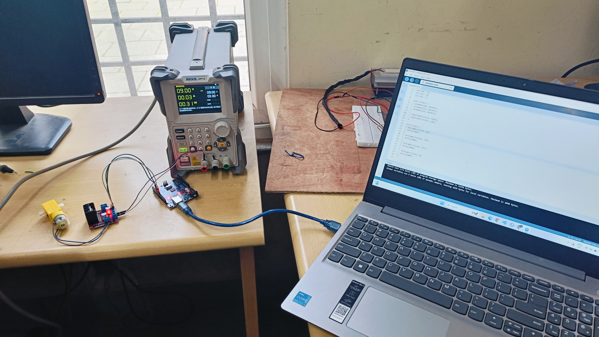
<video controls>
  <source src="DC-Motor-Working.mp4" type="video/mp4" alt="Circuit Working">
</video>

## 11: LED Toggle using ESP32 (Task 11)

Here, I created a **web-controlled LED system** using an **ESP32**. A **local web server** was hosted on the ESP32, allowing the LED to be toggled **ON/OFF** using my **personal WiFi network**. This task helped me understand **ESP32 basics**, **GPIO control** and **simple IoT web interfaces**.

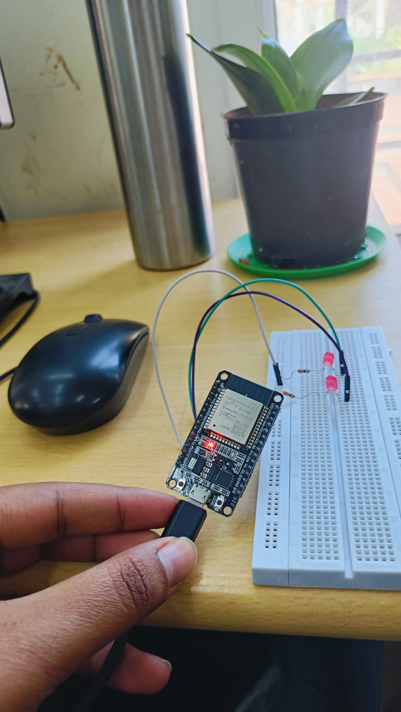

## 12: Soldering Prerequisites (Task 12)

In this task, I got familiar with **basic soldering equipment** including the **soldering handle**, **soldering wick**, **rosin flux**, **holder** and **electric supply**. Under coordinator supervision, I practiced by *desoldering an LED and soldering it back again*. This task helped me understand **proper soldering technique**, **heat control**, **component handling** and the role of **flux** and **wick** in clean solder joints.

## 13: Karnaugh Maps and Deriving the Logic Circuit (Task 14)

This task involved designing a **simple burglar alarm** using **2 input variables: door status and key press**. Using Karnaugh Map, I derived the logic such that the *alarm blinks when the door is open and the key is not pressed*. The logic circuit was also simulated in **Tinkercad**, helping reinforce Boolean simplification and basic digital logic implementation.

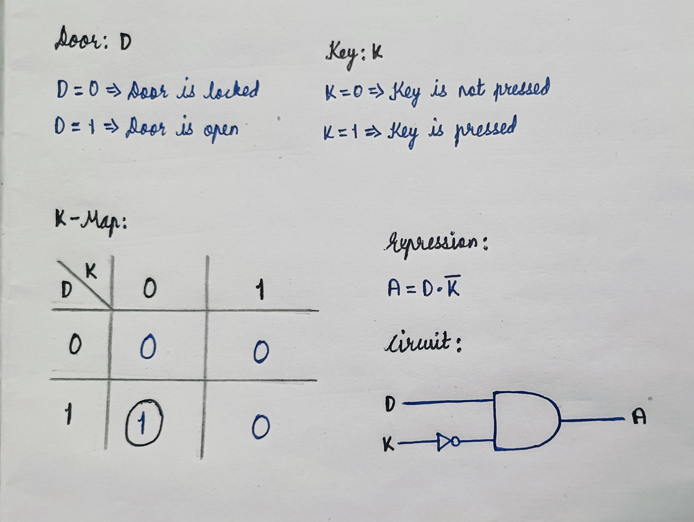
<video controls>
  <source src="Burglar-Alarm.mp4" type="video/mp4" alt="Simulation">
</video>

## 14: Active Participation (Task 15)

As part of active participation, I took part in **Bit N Build Around the World 2025**, a 24-hour hackathon organised by **GDG UVCE** in collaboration with **GDSC CRCE**. This provided exposure to collaborative problem-solving and real-world technical workflows in a team environment.

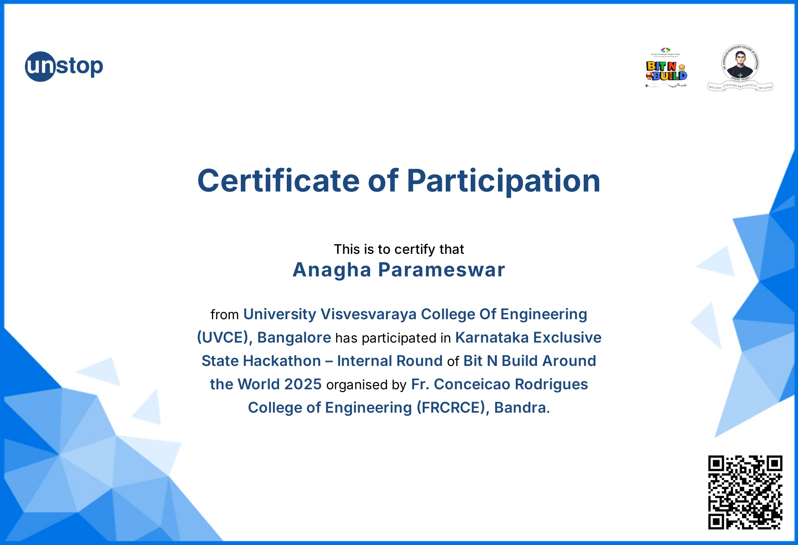

## 15: Sad Servers - "Like Leetcode for Linux" (Task 18)

This task involved completing the **Command Line Murders** scenario on **SadServers**, where **Linux command-line tools** were used to investigate structured files and identify the correct solution. Commands such as `grep`, `cat`, `sort`, `uniq`, `awk` and `md5sum` were used to *extract relevant information*, *filter suspects based on given clues* and *verify the final result using **checksum validation***. Through this task, I gained practical experience in Linux file **navigation**, **text processing** and **logical debugging**, improving my ability to *troubleshoot problems in a command-line environment*.

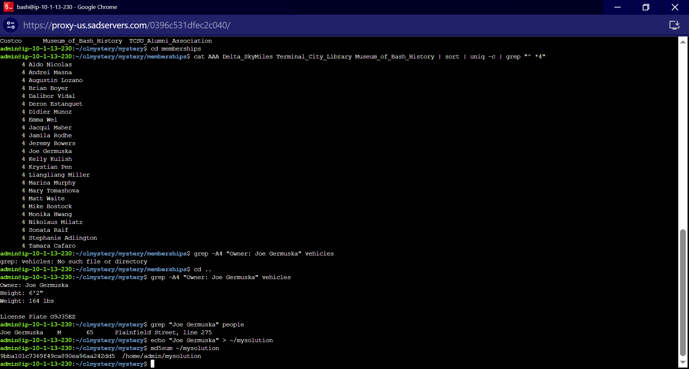
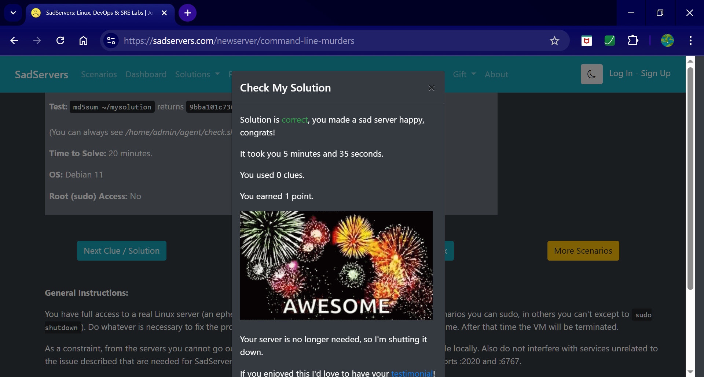

## 16: Making a Web App (Task 19)

As part of this task, a **Resource Library web application** was developed using **Node.js** and **Express.js**, enabling users to browse educational resources such as *articles and book*s, along with basic account management features. The application was structured using* Express routing, EJS templates and static assets for **styling and layout***. This project strengthened my understanding of **backend development**, **routing** and **integrating frontend and backend components**, while also providing hands-on experience in building a full-stack web application.

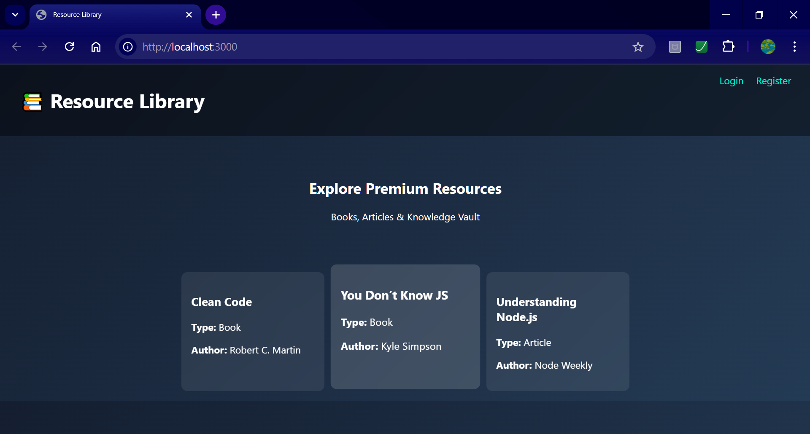
[View the GitHub Repository](https://github.com/SilverSquare-22/Resource-Library)